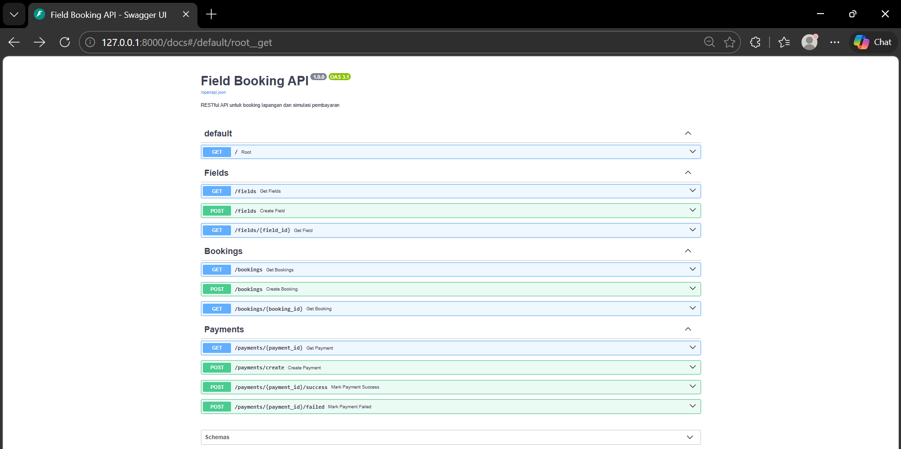
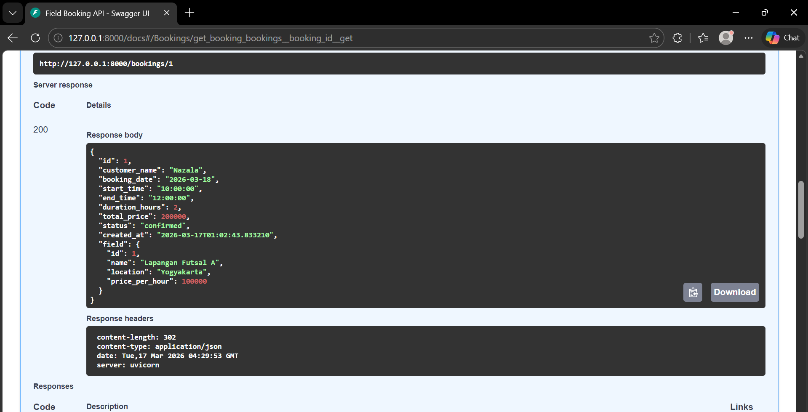
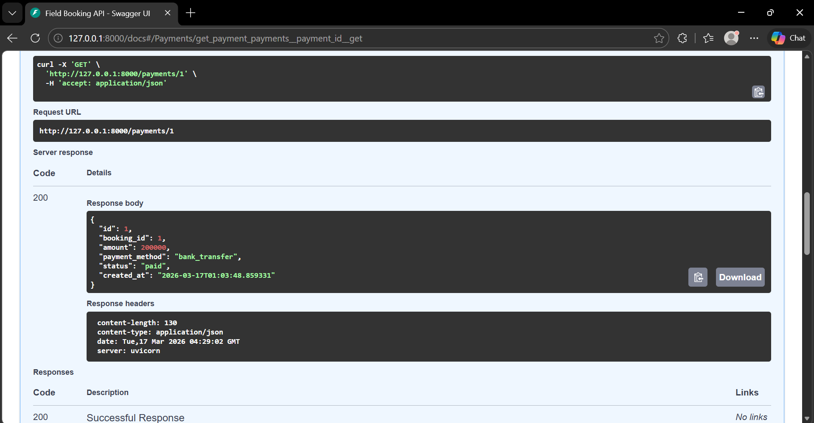

# Field Booking API

Field Booking API adalah backend RESTful API untuk mengelola proses booking lapangan dan simulasi alur pembayaran. Project ini dibangun menggunakan **FastAPI**, **SQLAlchemy**, dan **SQLite**.

---

## Fitur

- Menampilkan daftar lapangan
- Menambahkan data lapangan
- Membuat booking lapangan
- Menghitung durasi booking dan total harga secara otomatis
- Membuat data pembayaran berdasarkan booking
- Simulasi pembayaran berhasil dan gagal
- Memperbarui status booking berdasarkan hasil pembayaran
- Dokumentasi API interaktif dengan Swagger UI

---

## Teknologi yang Digunakan

- **Python**
- **FastAPI**
- **SQLAlchemy**
- **SQLite**
- **Uvicorn**

---

## Struktur Folder

```bash
field-booking-api/
├── app/
│   ├── __init__.py
│   ├── main.py
│   ├── database.py
│   ├── models.py
│   ├── schemas.py
│   └── routers/
│       ├── __init__.py
│       ├── fields.py
│       ├── bookings.py
│       └── payments.py
├── requirements.txt
├── README.md
└── .gitignore
```

---

## Alur Bisnis

API ini mensimulasikan proses booking dan pembayaran sederhana dengan alur sebagai berikut:

1. Pengguna melihat daftar lapangan yang tersedia
2. Pengguna membuat booking lapangan
3. Sistem menghitung durasi booking dan total harga secara otomatis
4. Pengguna membuat pembayaran untuk booking tersebut
5. Pembayaran dapat disimulasikan sebagai **berhasil** atau **gagal**
6. Status booking diperbarui berdasarkan hasil pembayaran

### Status Booking
- `pending`
- `confirmed`

### Status Payment
- `pending`
- `paid`
- `failed`

---

## Desain Database

Project ini menggunakan 3 entitas utama:

### 1. Fields
Menyimpan informasi lapangan seperti nama, lokasi, dan harga per jam.

### 2. Bookings
Menyimpan data booking, termasuk nama pelanggan, jadwal booking, durasi, total harga, dan status booking.

### 3. Payments
Menyimpan data pembayaran yang terhubung dengan booking, termasuk jumlah pembayaran, metode pembayaran, dan status pembayaran.

---

## Endpoint API

### Root
- `GET /`

### Fields
- `GET /fields`
- `GET /fields/{field_id}`
- `POST /fields`

### Bookings
- `GET /bookings`
- `GET /bookings/{booking_id}`
- `POST /bookings`

### Payments
- `GET /payments/{payment_id}`
- `POST /payments/create`
- `POST /payments/{payment_id}/success`
- `POST /payments/{payment_id}/failed`

---

## Instalasi

Clone repository:

```bash
git clone https://github.com/nzlf/field-booking-api.git
cd field-booking-api
```

Install dependency:

```bash
pip install -r requirements.txt
```

Jalankan server development:

```bash
uvicorn app.main:app --reload
```

---

## Akses API

Root endpoint:

```txt
http://127.0.0.1:8000/
```

Dokumentasi Swagger:

```txt
http://127.0.0.1:8000/docs
```

---

## Preview

### Tampilan Swagger Docs
<p align="center">
  
</p>

### Contoh Booking Berhasil
<p align="center">
  
</p>

### Contoh Payment Berhasil
<p align="center">
  
</p>

---

## Contoh Request

### Menambahkan Lapangan

```json
{
  "name": "Lapangan Futsal A",
  "location": "Yogyakarta",
  "price_per_hour": 100000
}
```

### Membuat Booking

```json
{
  "field_id": 1,
  "customer_name": "Nazala",
  "booking_date": "2026-03-18",
  "start_time": "10:00:00",
  "end_time": "12:00:00"
}
```

### Membuat Payment

```json
{
  "booking_id": 1,
  "payment_method": "bank_transfer"
}
```

---

## Contoh Alur Penggunaan

### 1. Tambahkan lapangan
Gunakan endpoint `POST /fields` untuk menambahkan data lapangan.

### 2. Buat booking
Gunakan endpoint `POST /bookings` untuk membuat booking.  
Sistem akan otomatis:
- menghitung durasi booking
- menghitung total harga
- menetapkan status booking menjadi `pending`

### 3. Buat payment
Gunakan endpoint `POST /payments/create` untuk membuat data pembayaran.

### 4. Simulasikan hasil pembayaran
Gunakan:
- `POST /payments/{payment_id}/success` untuk pembayaran berhasil
- `POST /payments/{payment_id}/failed` untuk pembayaran gagal

Jika pembayaran berhasil:
- status payment menjadi `paid`
- status booking menjadi `confirmed`

---

## Aturan Validasi

- `price_per_hour` harus lebih besar dari `0`
- `end_time` harus lebih besar dari `start_time`
- durasi booking harus dalam kelipatan 1 jam
- payment hanya bisa dibuat untuk booking yang sudah ada

---

## Tujuan Pembelajaran

Project ini dibuat untuk menunjukkan kemampuan dalam:

- membangun RESTful API
- menyusun struktur project backend yang rapi
- merancang relasi database
- menerapkan business logic
- menangani alur transaksi berbasis status

---

## Catatan

- Project ini menggunakan **SQLite** untuk development lokal
- File database tidak disertakan ke repository
- Alur payment pada project ini masih berupa **simulasi**, bukan integrasi payment gateway sungguhan

---

## Author

**Nazala Furqon**  